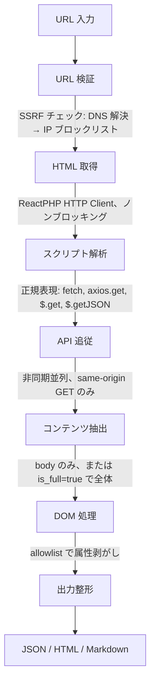

# LiteStrip

PHP (ReactPHP) 製の軽量 AI 最適化 HTML 変換ツール。

URL を渡すと、スタイリング属性を除去したクリーンな構造 HTML を返します。AI / LLM がWebページを読むために最適化されています。JavaScript 内の `fetch()` API エンドポイントを自動検出し、動的データも取得します。

## 特徴

- **属性剥がし** — `class`、`id`、`style`、`data-*` を除去し、意味のある属性 (`href`、`src`、`alt`、`datetime` 等) だけを保持
- **API 自動検出** — `<script>` 内の `fetch()` / `axios.get()` を正規表現で検出し、データを自動取得
- **テンプレートリテラル対応** — `` fetch(`/api/data?page=${page}`) `` からベース URL を抽出
- **複数出力形式** — JSON (デフォルト)、HTML、Markdown
- **SPA レンダリング** — ヘッドレス Chromium による JavaScript 実行済み HTML の取得 (`is_spa=true`、オプション)
- **SSRF 保護** — DNS 解決 + IP ブロックリスト + リダイレクト検証を内蔵
- **PHP 完結** — Node.js も Python も不要、PHP + ReactPHP のみ
- **Docker 対応** — `docker compose up -d --build` ですぐ動く

## クイックスタート

```bash
git clone https://github.com/space-musicacct/lite-strip.git
cd lite-strip
docker compose up -d --build
```

```bash
# JSON 出力 (デフォルト)
curl "http://localhost:8080/?url=https://example.com"

# HTML 出力
curl "http://localhost:8080/?url=https://example.com&format=html"

# Markdown 出力
curl "http://localhost:8080/?url=https://example.com&format=markdown"

# SPA レンダリング (ENABLE_SPA=true が必要)
curl "http://localhost:8080/?url=https://example.com&is_spa=true"
```

## API リファレンス

### エンドポイント

| メソッド | パス | 説明 |
|----------|------|------|
| GET / | `?url=...` | URL を処理して返却 |
| POST / | JSON body | URL を処理して返却 (長い URL やオプション指定向け) |
| GET /health | | ヘルスチェック |
| GET /docs | | API ドキュメントページ |

### パラメータ

| パラメータ | 型 | デフォルト | 説明 |
|-----------|------|---------|------|
| `url` | string | (必須) | 処理対象の URL |
| `format` | string | `json` | 出力形式: `json`、`html`、`markdown` |
| `follow_apis` | bool | `true` | script 内の API エンドポイントを検出・追従するか |
| `is_full` | bool | `false` | `<head>` メタデータを含めるか |
| `is_spa` | bool | `false` | ヘッドレス Chromium でレンダリングするか (`ENABLE_SPA=true` が必要) |
| `timezone` | string | サーバーデフォルト (デフォルトの docker-compose.yml なら `Asia/Tokyo`) | `fetchedAt` の IANA タイムゾーン (例: `Asia/Tokyo`, `UTC`) |
| `timeout` | int | `15` | リクエストタイムアウト (秒、最大 30) |
| `max_apis` | int | `5` | 追従する API エンドポイントの最大数 (最大 10) |

### JSON レスポンス

```json
{
  "ok": true,
  "data": {
    "url": "https://example.com",
    "finalUrl": "https://example.com",
    "title": "Example Domain",
    "contentHtml": "<h1>Example Domain</h1><p>...</p>",
    "contentText": "Example Domain ...",
    "meta": { "description": "...", "language": "en", "ogImage": null },
    "detectedApis": ["https://example.com/api/data"],
    "apiData": [{ "url": "...", "status": 200, "contentType": "application/json", "data": {} }],
    "failedApis": [],
    "warnings": []
  },
  "stats": {
    "fetchedAt": "2026-06-07T22:00:00+09:00",
    "fetchTimeMs": 230,
    "processTimeMs": 45,
    "totalTimeMs": 275,
    "apisDiscovered": 1,
    "apisFollowed": 1,
    "apisSucceeded": 1,
    "originalSizeBytes": 45230,
    "outputSizeBytes": 3200
  }
}
```

### エラーレスポンス

```json
{
  "ok": false,
  "error": {
    "code": "BLOCKED_URL",
    "message": "The requested URL resolves to a private network address"
  }
}
```

| コード | HTTP | 説明 |
|--------|------|------|
| `INVALID_URL` | 400 | URL が未指定または不正 |
| `INVALID_PARAMETER` | 400 | パラメータの型・範囲が不正 |
| `BLOCKED_URL` | 403 | SSRF 保護: プライベート IP に解決 |
| `UNSUPPORTED_SCHEME` | 422 | http / https 以外の URL |
| `RATE_LIMITED` | 429 | レート制限超過 |
| `FETCH_FAILED` | 502 | 取得先がエラーを返した |
| `RESPONSE_TOO_LARGE` | 502 | レスポンスが 2 MB を超えた |
| `SPA_DISABLED` | 501 | SPA モードがこのインスタンスで無効 |
| `SPA_QUEUE_FULL` | 503 | SPA レンダリングキューが満杯 |
| `TIMEOUT` | 504 | 取得先がタイムアウト |

## 設定

### 環境変数

| 変数 | デフォルト | 説明 |
|------|---------|------|
| `PORT` | `8080` | HTTP サーバーポート |
| `TZ` | `UTC` | タイムゾーン |
| `ENABLE_SPA` | `true` | SPA レンダリングモードの有効/無効 |
| `CHROMIUM_HOST` | - | Chromium コンテナのホスト名 (SPA 時に必要) |
| `CHROMIUM_PORT` | `9222` | Chromium DevTools Protocol ポート |

### SPA なしで軽量運用

```yaml
services:
  lite-strip:
    build: .
    ports:
      - "8080:8080"
    environment:
      - ENABLE_SPA=false
```

### ポート競合時の対処

ポート 8080 が既に使われている場合、ホスト側のポートマッピングを変更してください:

```yaml
services:
  lite-strip:
    ports:
      - "3000:8080"  # ポート 3000 を使用
```

コンテナのリスニングポート自体を変更する場合は `PORT` 環境変数も設定します:

```yaml
services:
  lite-strip:
    ports:
      - "3000:3000"
    environment:
      - PORT=3000
```

### CORS

全レスポンスに `Access-Control-Allow-Origin: *` を付与しています。任意のドメインのブラウザ JavaScript から直接呼び出せます。

## 仕組み



### 属性 allowlist

保持する属性:

| 属性 | 対象要素 |
|------|---------|
| `href` | `<a>` |
| `src` | ``、`<video>`、`<audio>`、`<source>` |
| `alt` | `` |
| `datetime` | `<time>` |
| `lang`、`dir` | 全要素 |
| `colspan`、`rowspan` | `<td>`、`<th>` |
| `type` | `<input>`、`<button>`、`<ol>` |
| `name`、`value`、`placeholder` | フォーム要素 |
| `content`、`charset` | `<meta>` |
| `rel` | `<link>`、`<a>` |

安全化変換 (ブラウザでの実行を防止):
- `<iframe src>` → `<iframe data-src>`
- `<form action>` → `<form data-action>`

## 技術スタック

- **PHP 8.5** (cli-alpine)
- **ReactPHP** — HTTP サーバー + 非同期 HTTP クライアント
- **DOMDocument** — HTML パース・属性操作
- **league/html-to-markdown** — Markdown 出力
- **chrome-php/chrome** — Chrome DevTools Protocol (SPA モード)
- **zenika/alpine-chrome** — ヘッドレス Chromium コンテナ (SPA モード)

## 競合比較

| ツール | 言語 | ブラウザ必須 | 出力 | PHP ネイティブ |
|--------|------|------------|------|--------------|
| Jina Reader | TypeScript | Yes (Chrome) | Markdown | No |
| Firecrawl | JS/Python | Yes | Markdown/JSON | No |
| Crawl4AI | Python | Yes (Playwright) | Markdown | No |
| Trafilatura | Python | No | Text/HTML | No |
| **LiteStrip** | **PHP** | **オプション** | **HTML/JSON/MD** | **Yes** |

## ライセンス

[MIT](LICENSE)
